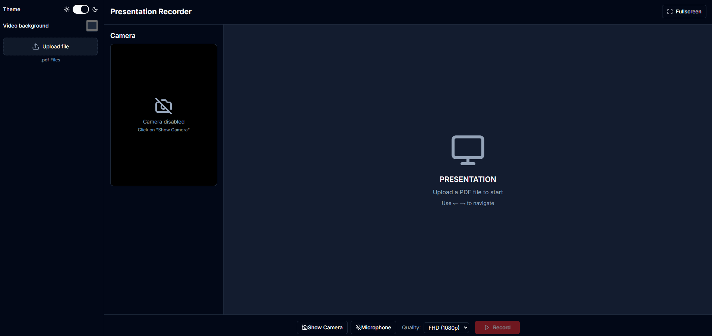
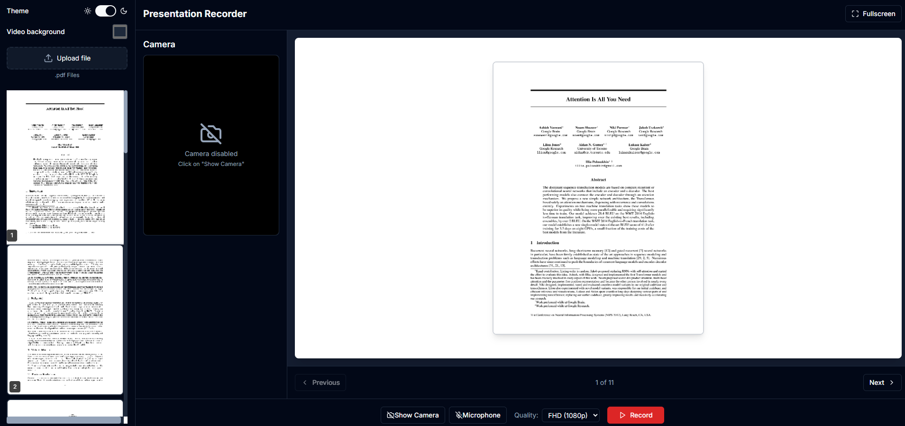
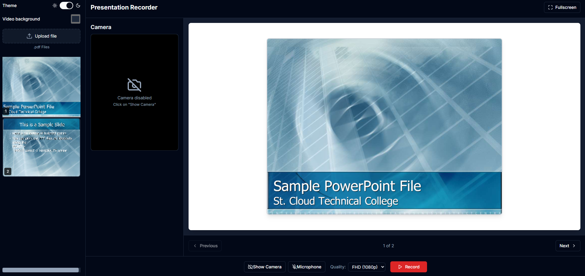
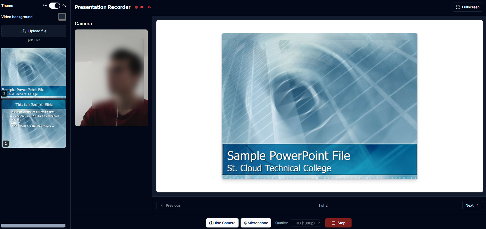
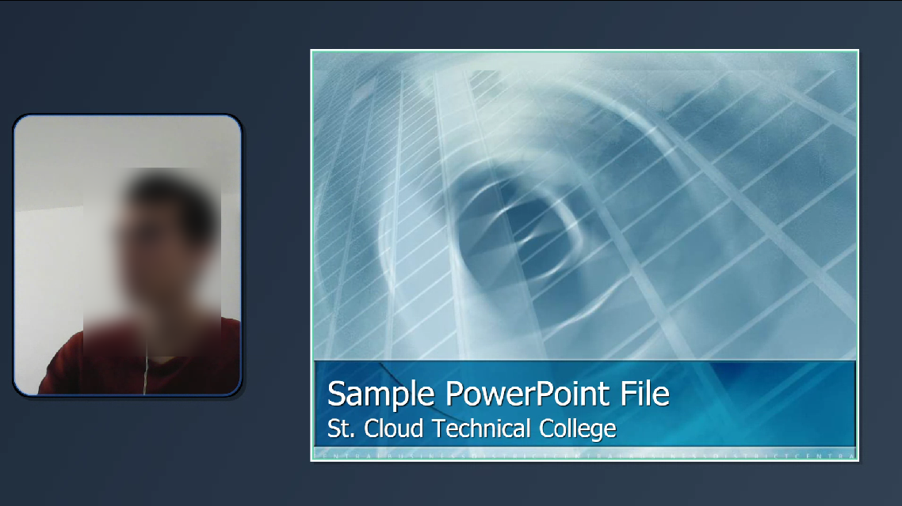

# Presentation Recording

A modern web application for recording and managing presentations, built with Next.js 14, TypeScript, and Tailwind CSS.

<p align="center">
  
</p>

Documents
<p align="center">
  
</p>

Presentations

<p align="center">
  
</p>

<p align="center">
  
</p>

Final video

<p align="center">
  
</p>

## 🚀 Features

- 🎥 Record presentations with audio and video
- 🎨 Modern, responsive UI built with Radix UI and Tailwind CSS
- 🌓 Light and dark mode support
- 🛠 TypeScript for type safety
- 🎥 Final video in format .webm


## 📦 Prerequisites

- Node.js 18 or later
- npm or pnpm

## 🚀 Getting Started


1. **Install dependencies**
   ```bash
   npm install
   # npm install --force
   # or
   pnpm install
   # or
   yarn install
   ```

2. **Run the development server**
   ```bash
   npm run dev
   # or
   pnpm dev
   # or
   yarn dev
   ```

3. Open [http://localhost:3000](http://localhost:3000) with your browser to see the result.

> **Note:** ⚠️  if you have file .pptx, you need to convert it to .pdf before uploading it to the application.


## 🛠 Available Scripts

- `npm run dev` - Start the development server
- `npm run build` - Build the application for production
- `npm start` - Start the production server
- `npm run lint` - Run ESLint


## 🤝 Contributing

Contributions are welcome! Please feel free to submit a Pull Request.

1. Fork the repository
2. Create your feature branch (`git checkout -b feature/AmazingFeature`)
3. Commit your changes (`git commit -m 'Add some AmazingFeature'`)
4. Push to the branch (`git push origin feature/AmazingFeature`)
5. Open a Pull Request

## 📄 License

This project is licensed under the MIT License - see the [LICENSE](LICENSE) file for details.


----

Created by [Diego Ivan Perea Montealegre](https://github.com/diegoperea20)


---

## 📊 Convert PPTX to PDF

| Platform | Tool | Command | Pros | Cons |
|----------|------|---------|------|------|
| **Linux** | `libreoffice --headless` | `libreoffice --headless --convert-to pdf file.pptx --outdir output/` | • Free, good for batch<br>• No GUI needed | • May have rendering differences |
| **Windows** | `win32com.client` | ```python import win32com.client as wc ppt = wc.Dispatch('PowerPoint.Application') pres = ppt.Presentations.Open(input_path) pres.ExportAsFixedFormat(output_path, 32) pres.Close(); ppt.Quit() ``` | • High fidelity<br>• Exact design | • Needs PowerPoint<br>• Windows only |
| **Windows** | `comtypes.client` | ```python import comtypes.client powerpoint = comtypes.client.CreateObject("Powerpoint.Application") powerpoint.Visible = 1 deck = powerpoint.Presentations.Open(input_path) deck.SaveAs(output_path, 32) deck.Close() powerpoint.Quit() ``` | • Python COM integration<br>• Good for automation | • Needs PowerPoint<br>• Windows only |